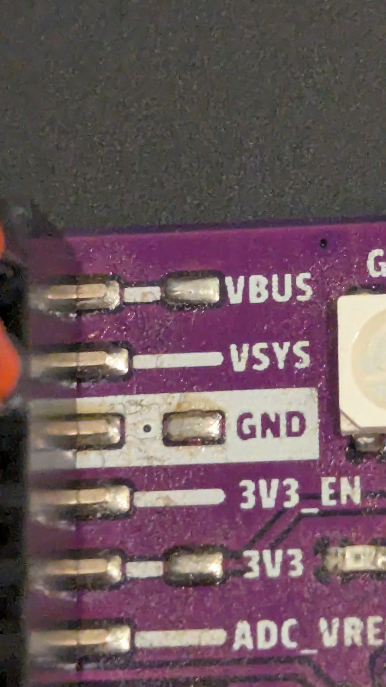
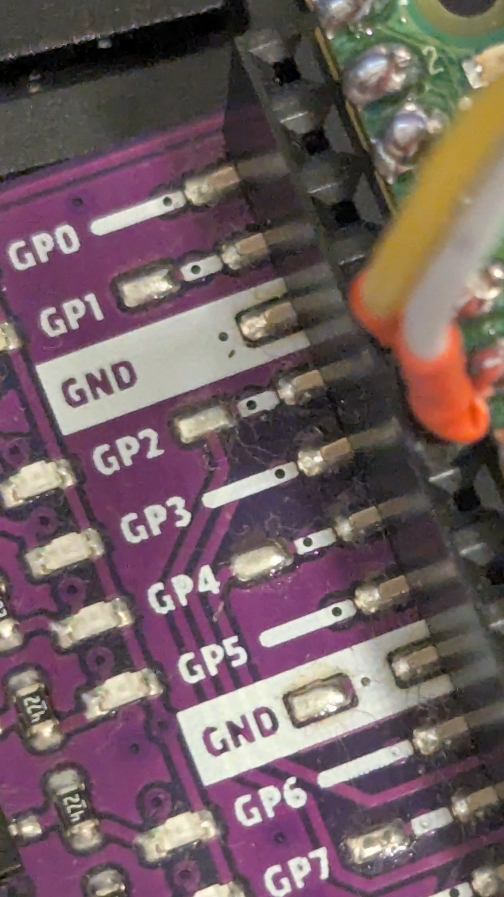
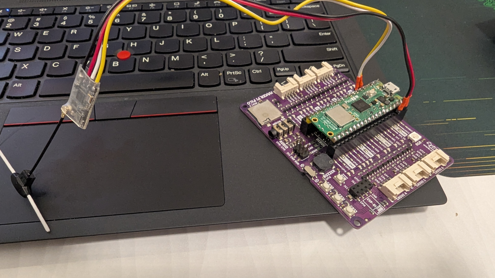
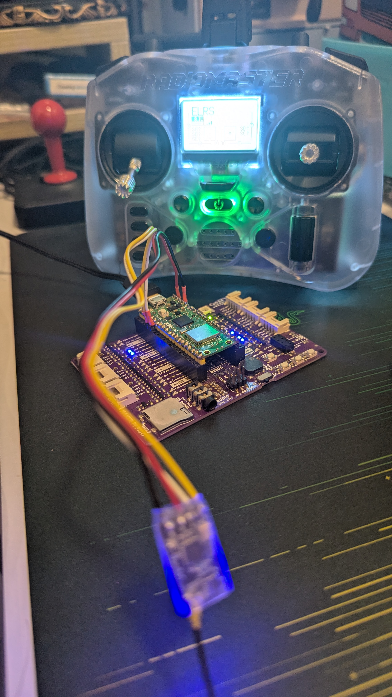

# MicroPython & CircuitPython CRSF Driver

A pure-Python port of the AlfredoCRSF C++ library tailored for RP2040-based boards running MicroPython or CircuitPython. The driver speaks the Team BlackSheep Crossfire (CRSF) protocol over UART and mirrors the behaviour of the original implementation while staying friendly to both firmware families.

## Features

- 420 kbaud CRSF RX/TX handling via `machine.UART` (MicroPython) or `busio.UART` (CircuitPython)
- RC channel decoding for 16 packed 11‑bit channels
- Link statistics parsing (RSSI, link quality, SNR, TX power)
- Failsafe monitoring with configurable link-quality and RSSI thresholds
- Battery and custom payload telemetry frame generation
- Callbacks for RC channels, link statistics, and failsafe state changes
- Optional utility to convert CRSF ticks to microseconds (`ticks_to_us`)

## Installation

Copy the `lib/crsf` package to your board's `lib/` directory:

- **MicroPython** – `mpremote fs cp -r lib/crsf :lib/`
- **CircuitPython** – mount the `CIRCUITPY` USB drive and copy the `lib/crsf` folder to `CIRCUITPY/lib/` (or use `circup`/`adafruit-ampy`).

The module also runs under CPython for development and unit testing.

## Quick start

```python
import board
import busio

from crsf import BAUD_RATE, CRSF, ticks_to_us

uart = busio.UART(
    board.GP4,
    board.GP5,
    baudrate=BAUD_RATE,
    timeout=0,
    receiver_buffer_size=512,
)
crsf = CRSF(uart)


def on_channels(channels):
    print("Channel 1 (µs)", ticks_to_us(channels[0]))


def on_link(stats):
    print("RSSI:", stats.rssi, "dBm", "LQ:", stats.link_quality, "%")


def on_failsafe(state):
    if state:
        print("Failsafe engaged")


crsf.set_on_rc_channels(on_channels)
crsf.set_on_link_statistics(on_link)
crsf.set_on_failsafe(on_failsafe)

while True:
    crsf.process_frames()
```

> Tip: On MicroPython you can continue using `machine.UART`—the `CRSF` class automatically adapts, so only the UART construction changes.

```python
from machine import Pin, UART

from crsf import BAUD_RATE, CRSF

uart = UART(1, baudrate=BAUD_RATE, tx=Pin(4), rx=Pin(5))
crsf = CRSF(uart)
```
```

## Screenshots

Here are some screenshots showing the CRSF driver in action:







## Telemetry helpers

```python
# Battery telemetry (values follow the CRSF specification)
crsf.telem_set_battery_data(
    voltage=1150,  # decivolts
    current=320,   # deciamps
    capacity=1650, # mAh
    percent=82,
)

# Send a custom frame (≤60 bytes)
crsf.telem_set_custom_payload(b"FW:v1.2.3")

# Telemetry frames are sent the next time process_frames() runs
```

## Development & testing

The repository includes CPython unit tests that exercise the driver logic with a stub UART. Run the suite with:

```bash
python -m unittest discover -s tests
```

This emulates the protocol behaviour without hardware so you can iterate quickly before deploying to a Pico.
